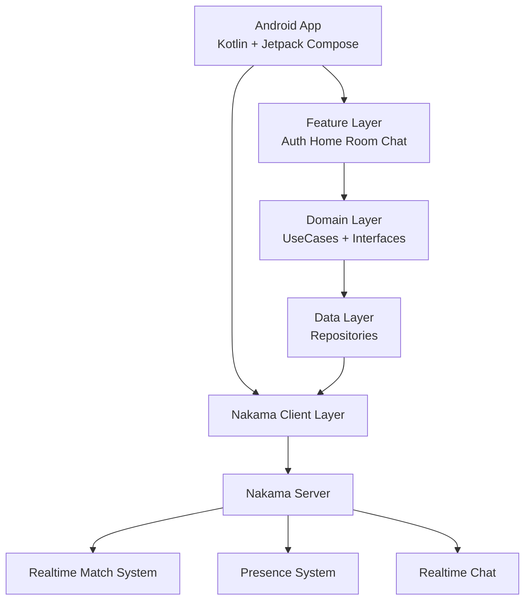

# Mirasta Gaming Platform

Social Multiplayer Gaming Platform inspired by platforms like Plato.

Mirasta is not a single game. The goal is to build a reusable social gaming infrastructure where games can be added later as plugins.

## Vision

Build the Social Core first:

- User identity
- Sessions
- Rooms
- Presence
- Realtime communication
- Multiplayer foundation

Game systems are outside the MVP scope.

## Current Architecture



## Repository Architecture

```
android/

core/
 ├── model/
 ├── network/
 └── common/

data/
 ├── auth/
 ├── room/
 └── chat/

domain/
 ├── auth/
 ├── room/
 └── chat/

feature/
 ├── auth/
 ├── home/
 ├── room/
 └── chat/
```

## Backend

Primary backend:

- Nakama Server
- Realtime multiplayer primitives
- Authentication
- Match lifecycle
- Presence
- Messaging

## MVP Scope

### Included

- Login
- User Session
- Home Screen
- Room Creation
- Join / Leave Room
- Presence Tracking
- Realtime Chat

### Not Included

- Game Plugin SDK
- AI Features
- Voice Chat
- Friends System
- Matchmaking
- Individual Games

## Application Flow

```
Login
  |
  v
Session
  |
  v
Home
  |
  v
Room
  |
  v
Presence + Chat
```

## Technology Stack

### Client

- Kotlin
- Jetpack Compose
- Coroutines
- StateFlow

### Backend

- Nakama
- Realtime Match API
- Server Runtime (future)

## Development Roadmap

### Phase 1 - Social Core

- Authentication
- Session management
- Room lifecycle
- Presence
- Chat

### Phase 2 - Platform Features

- Profiles
- Friends
- Notifications

### Phase 3 - Gaming Platform

- Game Plugin Architecture
- Matchmaking
- Voice
- AI Services

## Project Goal

Prove the Social Multiplayer Core with Nakama before expanding into a complete gaming platform.
